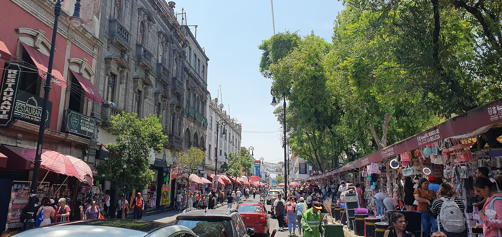

---
format:
    html:
        toc: false
---

::: {.column-screen}

:::

## ¿Qué viene a tu mente al pensar en pobreza?

Probablemente personas en condición de calle o en lugares remotos del país...

Si bien lo anterior podría formar parte de una condición de pobreza, existen muchas otras formas de pobreza que usualmente no se toman con la seriedad que deberían.

La medición de la pobreza en nuestro país ha sido desarrollada casi siempre desde una perspectiva unidimensional, utilizando al ingreso como una aproximación del bienestar económico de la población. 

El principal indicador que se utiliza define una línea de pobreza que representa el ingreso mínimo necesario para adquirir una canasta de bienes indispensables. Dicho umbral es comparado con el ingreso de las personas para determinar aquellos que son pobres.

Sin embargo, la pobreza también está asociada a condiciones de vida que:

* Vulneran la dignidad de las personas,
* Limitan sus derechos y libertades fundamentales,
* Impiden la satisfacción de sus necesidades básicas,
* Imposibilitan su plena integración social.

La pobreza debe medirse desde varios enfoques que se relacionan con derechos humanos, económicos, sociales y culturales. Hoy abordaremos la pobreza desde tres enfoques generales:

::: {.grid}

::: {.g-col-12 .g-col-md-4}
::: {.callout-note}
## Enfoque Monetario
[Explorar →](notebooks/enfoque_monetario.qmd)
:::
:::

::: {.g-col-12 .g-col-md-4}
::: {.callout-warning}
## Carencias Sociales
[Explorar →](notebooks/enfoque_carencias.qmd)
:::
:::

::: {.g-col-12 .g-col-md-4}
::: {.callout-tip}
## Capacidades
[Explorar →](notebooks/ods9.qmd)
:::
:::

:::