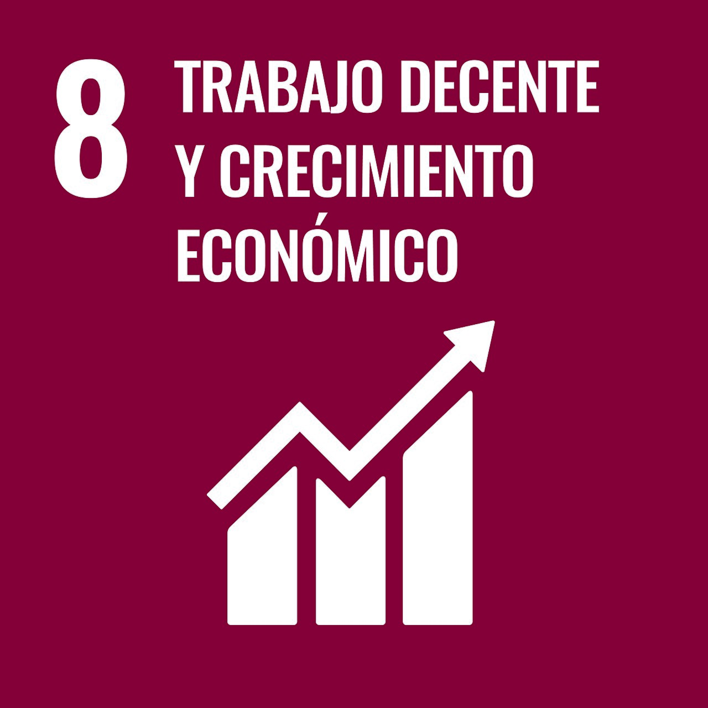

## Introducción: El Enfoque de Capacidades

Para este enfoque nos centramos en los ODS relacionados con el trabajo y crecimiento económico, así como la infraestructura e innovación. Estos son:

* El **ODS 8** busca garantizar el acceso a **trabajo decente y crecimiento económico inclusivo**, reconociendo que el empleo formal, bien remunerado y con protección social amplía sustancialmente las capacidades de las personas.
* El **ODS 9** pretende construir **infraestructuras resilientes, promover la industrialización sostenible y fomentar la innovación**.

Juntos, estos ODS trazan una ruta hacia un desarrollo donde las personas no solo sobreviven, sino que pueden desarrollarse plenamente.

---

## Profundización por ODS

Selecciona un ODS para ver el análisis de indicadores correspondiente:

::: {layout-ncol=2 .text-center .ods-icons}

[{width=150}](enfoque_capacidades.qmd)

[{width=150}](ods9.qmd)

:::
