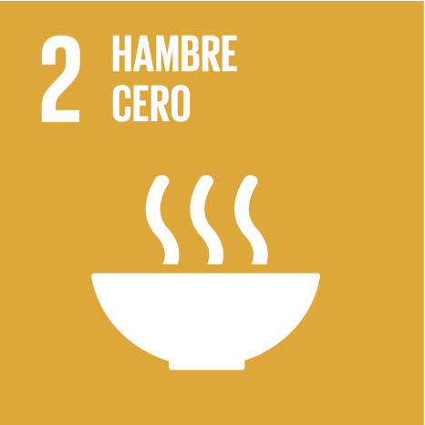
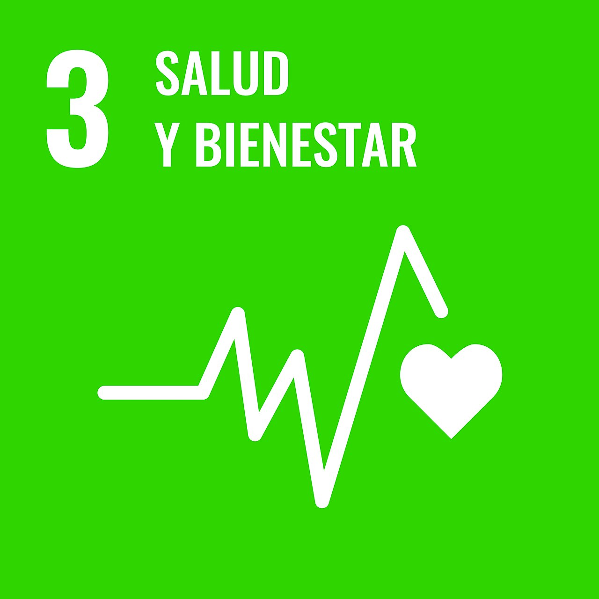
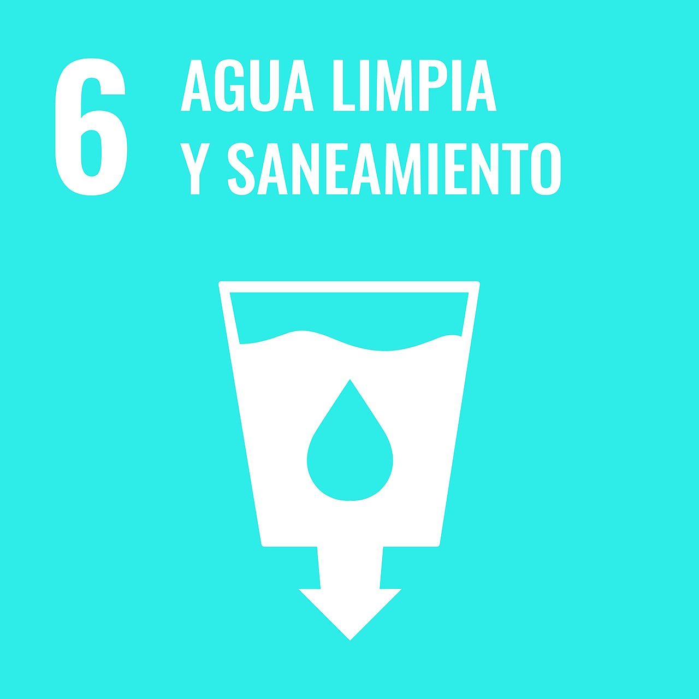

## Introducción: ODS 1 y la Pobreza Multidimensional

La **Meta 1n.1** busca reducir la pobreza multidimensional. En México, esto se mide a través de las carencias sociales. A continuación, se detallan las metas específicas del ODS 1 relacionadas con la seguridad social y servicios básicos:

### Metas del ODS 1 en México
* **Meta 1.3 (Seguridad Social):** Definir protección/seguridad social. Se considera que cuentas con ella si:
    * Tienes prestaciones de ley (IMSS, ISSSTE, etc.).
    * Eres jubilado o pensionado.
    * Eres beneficiario de un familiar con acceso.
* **Meta 1.4 (Servicios Básicos):** Tu hogar debe contar con agua potable, saneamiento, energías limpias y recolección de 
    * Tienes prestaciones de ley (IMSS, ISSSTE, etc.).
    * Eres jubilado o pensionado.
    * Eres beneficiario de un familiar con acceso.desechos.
* **Meta 1.a (Inversión del gobierno):**
    * Se refiere a la movilización de recursos públicos para implementar programas y políticas dirigidas a la erradicación de la pobreza
    * Incluye inversión en infraestructura social, servicios básicos, educación y salud
    * Busca priorizar a las poblaciones en situación de vulnerabilidad y reducir desigualdades regionales
* **Meta 1n.1 (Pobreza multidimensional):**
    * Considera no solo el ingreso, sino también carencias sociales como educación, salud, vivienda, alimentación y servicios básicos
    * Permite identificar a la población en situación de pobreza de manera integral
    * Funciona como base para analizar el cumplimiento del resto de las metas en esta sección
    * Se recomienda destacar las entidades federativas con mayores niveles de pobreza multidimensional
* **Meta 1n.2 (Salud de las infancias):**
    * Evalúa el acceso a servicios de salud para niñas y niños
    * Considera factores como nutrición, vacunación y atención médica oportuna
    * Busca reducir enfermedades prevenibles y mejorar el bienestar infantil
    * Es clave analizar las regiones con mayores rezagos en salud infantil para focalizar intervenciones

## Profundización por ODS

Con el fin de profundizar en cada una de las carencias sociales, se profundiza en su respectivo ODS.

Selecciona un ODS para ver el dashboard específico y el análisis de carencias:

::: {layout-ncol=4 .text-center .ods-icons}

[{width=150}](enfoque_carencias.qmd)

[{width=150}](enfoque_carencias.qmd)

[{width=150}](enfoque_carencias.qmd)

[{width=150}](enfoque_carencias.qmd)

:::