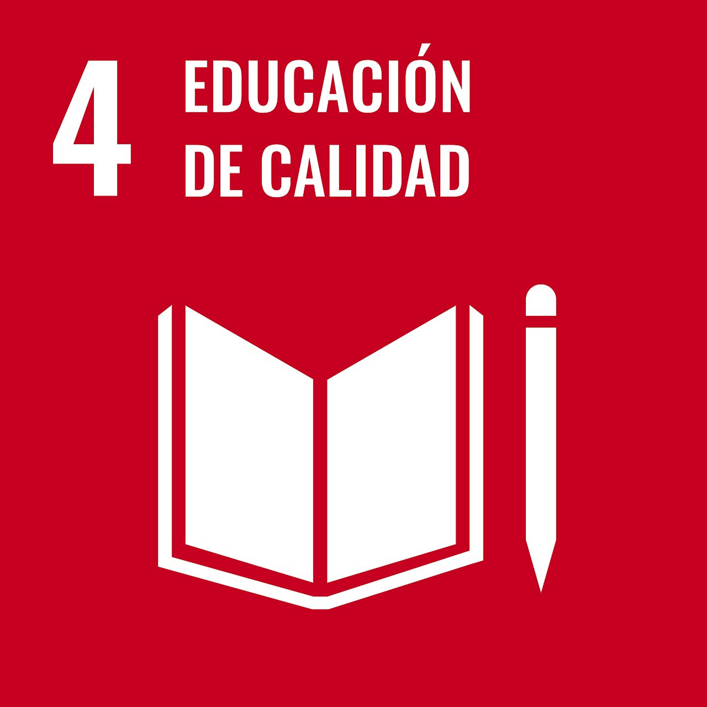
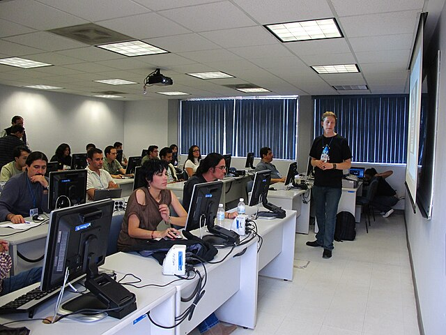

```{python}
#| label: imports
#| output: false
import plotly.express as px

df = px.data.gapminder().query("year == 2007")

def fig_demo(title):
    f = px.scatter(
        df, x="gdpPercap", y="lifeExp",
        size="pop", color="continent",
        hover_name="country", log_x=True, size_max=45,
        title=title
    )
    f.update_layout(
        paper_bgcolor="rgba(0,0,0,0)",
        plot_bgcolor="rgba(245,245,235,0.95)",
        font=dict(color="#1b2a1f"),
        margin=dict(l=10, r=10, t=40, b=10),
        legend=dict(orientation="h", y=-0.25, x=0.5, xanchor="center"),
    )
    return f
```

<!-- ============================================================
     SECCIÓN 1 · ALFABETIZACIÓN
     ============================================================ -->

## Row {height="90px"}

### Column {width="10%"}

:::{.card .icono-ods}

:::

### Column {width="25%"}

:::{.card .titulo-seccion}
Alfabetización
:::

### Column {width="65%"}

:::{.card .frase-destacada}
No puede haber ciudadanía plena sin personas alfabetas.
:::

## Row {height="400px"}

### Column {width="40%"}

```{python}
#| title: "ODS4 — Alfabetización en el tiempo"
fig_demo("Evolución temporal")
```

### Column {width="20%"}

:::{.card .nota-chalkboard}
Aprender a leer y escribir es el primer paso para garantizar que una persona pueda defender sus derechos.
:::

### Column {width="40%"}

```{python}
#| title: "ODS4 — Mapa de alfabetización"
fig_demo("Mapa nacional")
```

## Row {height="400px"}

### Column {width="40%"}

```{python}
#| title: "ODS4 — Alfabetización municipal"
fig_demo("Alfabetización municipal")
```

### Column {width="20%"}

:::{.card .nota-chalkboard}
Al 2024, Guerrero, Oaxaca y Chiapas (tres de los estados con mayor porcentaje de población indígena) se mantienen por debajo del 90% de población alfabeta.
:::

### Column {width="40%"}

```{python}
#| title: "ODS4 — Rangos de alfabetización"
fig_demo("Rangos por grupo")
```

<!-- ============================================================
     SECCIÓN 2 · REZAGO EDUCATIVO
     ============================================================ -->

## Row {height="120px"}

### Column {width="10%"}

:::{.card .icono-ods}

:::

### Column {width="25%"}

:::{.card .titulo-seccion}
Rezago Educativo
:::

### Column {width="65%"}

:::{.card .frase-destacada .frase-doble}
La alfabetización suele ocurrir durante los primeros años de la escolaridad.

La educación es el principal medio para desarrollar y potenciar las habilidades, conocimientos y valores éticos de las personas.
:::

## Row {height="400px"}

### Column {width="40%"}

```{python}
#| title: "ODS4 — Finalización por nivel"
fig_demo("Finalización por nivel educativo")
```

### Column {width="20%"}

:::{.card .nota-chalkboard}
Es en el nivel de Preparatoria donde hay menor finalización, y dicho fenómeno es similar en todos los estados.
:::

### Column {width="40%"}

```{python}
#| title: "ODS4 — Rezago municipal"
fig_demo("Rezago educativo municipal")
```

## Row {height="420px"}

### Column {width="30%"}

:::{.card .imagen-aula}

:::

### Column {width="70%"}

#### Row {height="60px"}

:::{.card .banner-infraestructura}
La infraestructura escolar garantiza que se materialice el derecho a la educación.
:::

#### Row

```{python}
#| title: "ODS4 — Escuelas y servicios"
fig_demo("Infraestructura escolar por nivel")
```
